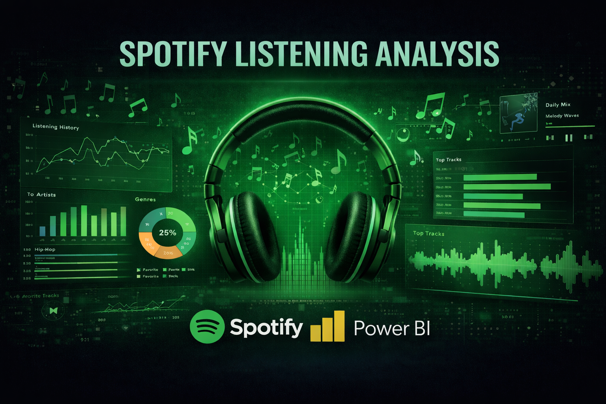
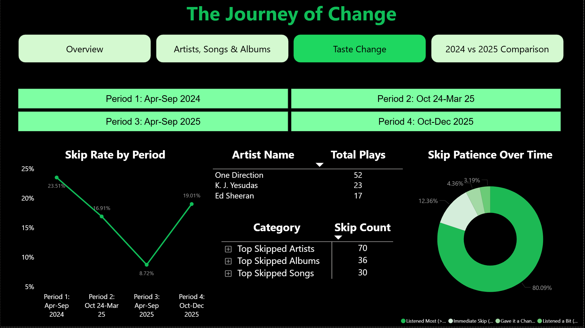
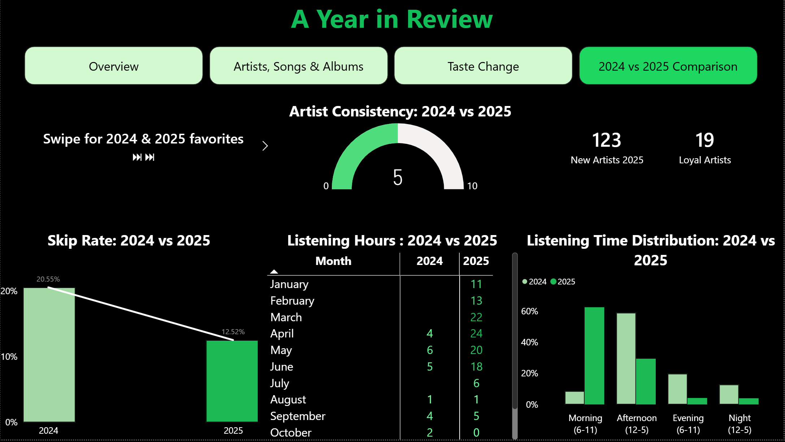

# Spotify Listening History Analysis & Power BI Dashboard




---

## Overview

This project analyzes 20 months of personal Spotify listening history (April 2024 - December 2025) to uncover listening patterns, music taste evolution, and behavioral insights. The analysis combines Python-based exploratory data analysis with an interactive Power BI dashboard featuring 4 pages, 21 custom DAX measures, and dynamic filtering capabilities.

**Business Value:** Demonstrates end-to-end data analytics workflow from raw JSON data extraction and Python preprocessing to advanced business intelligence visualization, showcasing both technical programming skills and business storytelling through interactive dashboards.

---

## Project Components

### 1. Python Data Analysis (Jupyter Notebook)
- **Data extraction** from Spotify Extended Streaming History JSON
- **Data cleaning** and temporal feature engineering
- **Exploratory analysis** of 2,727 listening records
- **Timezone conversion** (UTC → Pacific Time)
- **Export** to CSV for Power BI consumption

### 2. Power BI Dashboard (4 Interactive Pages)
- **Page 1:** Overview with KPIs and temporal patterns
- **Page 2:** Top artists, songs, and albums rankings
- **Page 3:** Behavioral analysis with skip patterns and taste evolution
- **Page 4:** Year-over-year comparison (2024 vs 2025)

---

## Key Features

### Python Analysis
- **JSON data extraction** from Spotify Extended Streaming History export
- **Data cleaning pipeline** filtering songs only (removing podcasts/ads)
- **Temporal feature engineering** — day of week, time of day, hour extraction
- **Timezone conversion** from UTC to Pacific Time for accurate temporal analysis
- **Statistical analysis** of listening patterns across 2,727 records

### Power BI Dashboard
- **21 custom DAX measures** for dynamic KPI calculations
- **5 calculated columns** for categorization and segmentation
- **4 interactive pages** with seamless navigation
- **Dynamic filtering** by year, month, and custom time periods
- **Advanced visualizations** including skip rate trends, artist consistency gauge, and listening distribution charts
- **Spotify-themed design** with dark background (#191414) for brand consistency

---

## Dataset

| Property | Detail |
|----------|--------|
| Source | Spotify Extended Streaming History (personal data export) |
| Time Period | April 2024 - December 2025 (20 months) |
| Total Records | 2,727 listening events |
| Unique Tracks | Varied across time periods |
| Unique Artists | Tracked across 4 periods |
| Data Format | JSON (source) → CSV (processed) → Power BI |

### Data Fields
- **Timestamp:** UTC timestamp converted to Pacific Time
- **Track Name:** Song title
- **Artist:** Album artist name
- **Album:** Album name
- **Duration (ms):** Milliseconds played
- **Skipped:** Boolean flag for skip events
- **Track URI:** Spotify unique identifier

---

## Tech Stack

### Python Analysis
- **Python 3.9+**
- **Pandas** — data manipulation and cleaning
- **Datetime** — timezone conversion and temporal features
- **JSON** — parsing Spotify data exports
- **Jupyter Notebook** — analysis environment

### Power BI Dashboard
- **Power BI Desktop**
- **DAX** — 21 custom measures for KPI calculations
- **Power Query** — data transformation
- **Custom visuals** — chiclet slicers, gauge charts

---

## Installation & Setup

### Part 1: Python Analysis

```bash
# Clone the repository
git clone https://github.com/yourusername/spotify-analysis.git
cd spotify-analysis

# Install dependencies
pip install -r requirements.txt

# Run the analysis notebook
jupyter notebook Spotify_analysis.ipynb
```

**Prerequisites:**
1. Export your Spotify Extended Streaming History from Spotify Privacy Settings
2. Place JSON files in `data/` folder
3. Run notebook to generate cleaned CSV

---

### Part 2: Power BI Dashboard

**View the Dashboard:**
- 📹 [Watch Interactive Demo Video](https://drive.google.com/file/d/1dGQsEUa4y6WraE5n2c2CLhZTDG-FLVE8/view?usp=sharing)
- 📸 View detailed screenshots of all 4 pages below

---

## Project Structure

```
spotify-analysis/
├── README.md
├── requirements.txt
├── .gitignore
├── Spotify_analysis.ipynb (Python EDA)
└── images/
    ├── banner.png
    ├── page1.png (Overview)
    ├── page2.png (Artists & Songs)
    ├── page3.png (Journey of Change)
    └── page4.png (2024 vs 2025)
```

**Note:** Personal Spotify data files are not included in the repository. See "How to Get Your Own Spotify Data" section below to analyze your own listening history.

---

## Dashboard Pages

### Page 1: Overview - "A Listening Journey: Spotify Edition"

**KPI Cards:**
- Total Plays, Unique Tracks, Unique Artists
- Total Hours, Days Listened, Peak Listening Hour

**Visualizations:**
- Monthly Listening Trend (Area Chart)
- Day of Week Distribution (Column Chart)
- Time of Day Pattern (Column Chart)

**Filters:** Year, Month slicers


---

### Page 2: "The Artists & Melodies"

**Top Rankings:**
- Top 10 Artists (Horizontal Bar Chart)
- Top 10 Songs (Horizontal Bar Chart)
- Top 10 Albums (Table)

**Filters:** Year, Month slicers


---

### Page 3: "The Journey of Change"

**Behavioral Analysis:**
- Skip Rate Trend (Line Chart with markers)
- Skip Patience Distribution (Donut Chart)
  - Immediate Skip (<15 seconds)
  - Gave it a Chance (15-45 seconds)
  - Listened a Bit (45 sec - 2 min)
  - Listened Most (>2 minutes)
- Skipped Summary (Top 5 skipped songs/artists/albums)
- New Artists by Period (Table)

**Filters:** Period Selector (4 chiclet slicers for 6-month intervals)



---

### Page 4: "2024 vs 2025 Comparison"

**Year-over-Year Metrics:**
- Top Artist/Album/Song for each year
- Artist Consistency Gauge (% overlap in top 10)
- New Artists 2025 vs Loyal Artists
- Skip Rate Comparison (20.55% → 12.52%)
- Listening Hours Monthly Matrix
- Time Distribution by Year



---

## Key Insights

### 1. Skip Behavior Evolution
**Finding:** Skip rate decreased from 20.55% (2024) to 12.52% (2025), indicating improved music curation or more patient listening behavior.

**Analysis:** The Skip Patience donut chart reveals most skips occur in the first 15 seconds, suggesting instant reactions to song choices rather than gradual disinterest.

### 2. Listening Consistency Patterns
**Finding:** Peak listening hour and time-of-day distribution remained stable across years, indicating consistent daily routines.

**Insight:** Understanding these patterns enables playlist optimization for specific times of day.

### 3. Artist Discovery & Loyalty
**Finding:** Significant artist overlap between years (tracked via Artist Consistency gauge) balanced with steady new artist discovery each period.

**Business Value:** Demonstrates both loyalty to preferred artists and openness to music exploration — valuable for recommendation algorithm tuning.

---

## DAX Measures & Calculated Columns

### Key Measures

**Basic KPIs:**
```dax
Total_Plays = COUNTA('spotify_listening_history_1'[track_name])

Unique_Artists = DISTINCTCOUNT('spotify_listening_history_1'[artist_name])

Total_Listening_Hours = 
ROUND(SUM('spotify_listening_history_1'[ms_played]) / 3600000, 0)
```

**Skip Rate Analysis:**
```dax
Skip Rate = 
VAR CurrentPeriod = SELECTEDVALUE('spotify_listening_history_1'[Period])
VAR SkippedCount = CALCULATE(
    COUNTROWS('spotify_listening_history_1'),
    'spotify_listening_history_1'[skipped] = TRUE,
    'spotify_listening_history_1'[Period] = CurrentPeriod
)
VAR TotalCount = CALCULATE(
    COUNTROWS('spotify_listening_history_1'),
    'spotify_listening_history_1'[Period] = CurrentPeriod
)
RETURN
DIVIDE(SkippedCount, TotalCount, 0)
```

**Year-over-Year Artist Comparison:**
```dax
Artist Overlap Count = 
VAR Top10Artists2024 = CALCULATETABLE(
    TOPN(10,
        VALUES('spotify_listening_history_1'[artist_name]),
        [Total_Plays], DESC
    ),
    YEAR('spotify_listening_history_1'[date]) = 2024
)
VAR Top10Artists2025 = CALCULATETABLE(
    TOPN(10,
        VALUES('spotify_listening_history_1'[artist_name]),
        [Total_Plays], DESC
    ),
    YEAR('spotify_listening_history_1'[date]) = 2025
)
RETURN
COUNTROWS(INTERSECT(Top10Artists2024, Top10Artists2025))
```

### Calculated Columns

**Temporal Categorization:**
```dax
Time_of_Day = 
SWITCH(
    TRUE(),
    AND('spotify_listening_history_1'[hour] >= 6, 
        'spotify_listening_history_1'[hour] < 12), "Morning (6-11)",
    AND('spotify_listening_history_1'[hour] >= 12, 
        'spotify_listening_history_1'[hour] < 18), "Afternoon (12-5)",
    AND('spotify_listening_history_1'[hour] >= 18, 
        'spotify_listening_history_1'[hour] < 24), "Evening (6-11)",
    AND('spotify_listening_history_1'[hour] >= 0, 
        'spotify_listening_history_1'[hour] < 6), "Night (12-5)"
)
```

**Period Segmentation:**
```dax
Period = 
VAR CurrentYear = YEAR('spotify_listening_history_1'[date])
VAR CurrentMonth = MONTH('spotify_listening_history_1'[date])
RETURN
IF(AND(CurrentMonth >= 4, AND(CurrentMonth <= 9, CurrentYear = 2024)), 
   "Period 1: Apr-Sep 2024",
IF(AND(CurrentMonth >= 10, CurrentYear = 2024), 
   "Period 2: Oct 24-Mar 25",
IF(AND(CurrentMonth <= 3, CurrentYear = 2025), 
   "Period 2: Oct 24-Mar 25",
IF(AND(CurrentMonth >= 4, AND(CurrentMonth <= 9, CurrentYear = 2025)), 
   "Period 3: Apr-Sep 2025",
IF(AND(CurrentMonth >= 10, CurrentYear = 2025), 
   "Period 4: Oct-Dec 2025", "Unknown")))))
```

**Additional Measures:** The dashboard includes 16 more custom measures for rankings, comparisons, and dynamic filtering across all 4 pages.

---

## Python Analysis Workflow

### Step 1: Data Extraction
```python
import json
import pandas as pd

# Load Spotify JSON export
with open('spotify_streaming_history.json', 'r') as f:
    data = json.load(f)

df = pd.DataFrame(data)
```

### Step 2: Data Cleaning
```python
# Filter songs only (remove podcasts/ads)
df_songs = df[df['master_metadata_track_name'].notna()]

# Select relevant columns
df_clean = df_songs[[
    'ts', 'ms_played', 'master_metadata_track_name',
    'master_metadata_album_artist_name', 
    'master_metadata_album_album_name',
    'skipped'
]]
```

### Step 3: Temporal Feature Engineering
```python
# Convert UTC to Pacific Time
df_clean['ts'] = pd.to_datetime(df_clean['ts']).dt.tz_localize('UTC').dt.tz_convert('US/Pacific')

# Extract temporal features
df_clean['day_of_week'] = df_clean['ts'].dt.day_name()
df_clean['hour'] = df_clean['ts'].dt.hour
df_clean['month'] = df_clean['ts'].dt.month
```

---

## Business Applications

- **Music recommendation systems** — understanding skip patterns to improve algorithm accuracy
- **Playlist optimization** — time-of-day listening patterns inform contextual playlist creation
- **Artist discovery** — tracking new vs loyal artist balance for platform health metrics
- **User engagement** — skip rate as proxy for content satisfaction and curation quality
- **Behavioral insights** — temporal patterns reveal lifestyle routines and listening contexts

---

## Future Enhancements

### Python Analysis
- **Sentiment analysis** of lyrics for mood tracking
- **Genre classification** using Spotify API integration
- **Machine learning** to predict skip likelihood based on song features
- **Clustering analysis** to identify distinct listening personas

### Power BI Dashboard
- **Real-time updates** via Python script automation
- **Predictive analytics** showing projected listening trends
- **Social comparison** anonymized benchmarking against Spotify averages
- **Mobile optimization** for Power BI Service deployment

---

## How to Get Your Own Spotify Data

1. Go to [Spotify Privacy Settings](https://www.spotify.com/account/privacy/)
2. Request "Extended Streaming History" under Download Your Data
3. Wait 5-30 days for email with download link
4. Extract JSON files and use this project to analyze!
