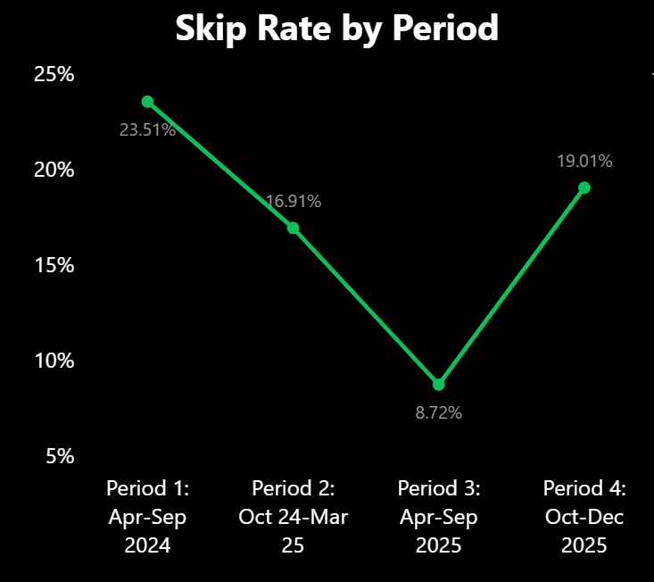

# A Listening Journey: Spotify Data Analysis

## 1. Background & Overview

Over the past 20 months, Spotify captured 2,727 of my streaming records with rich metadata—from timestamps and skip behavior to song duration and artist information. As a data analyst, I saw an opportunity to move beyond simple statistics and tell a narrative about how my musical taste has evolved. I began with exploratory data analysis in Python (Pandas, JSON processing) to clean and prepare the data, then built a comprehensive Power BI dashboard to visualize the story. Rather than asking "what did I listen to?", I asked "when, how, and why did my preferences change?"

**The goal**: Transform raw listening history into visual storytelling through both technical analysis and interactive dashboards, revealing patterns about artist loyalty, skip behavior evolution, and the subtle shifts between 2024 and 2025. This project demonstrates core data analyst skills—data cleaning, exploratory analysis, DAX calculations, and visualization design—all while exploring a personal dataset that's inherently interesting.

---

## 2. Data Structure Overview

**Source**: Spotify Extended Streaming History (April 2024 – December 2025)

**Primary Dataset**:
- `spotify_listening_history.csv` – Cleaned listening events (2,727 records)
  - Timestamp (ts), milliseconds played, skip flag
  - Track name, artist, album
  - Spotify track URI

**Key Derived Fields**:
- **Period**: 4 time windows (Apr-Sep 2024, Oct 2024–Mar 2025, Apr-Sep 2025, Oct-Dec 2025)
- **Skip Patience**: Categorization based on milliseconds played (Immediate <15s, Gave it a Chance 15-45s, Listened a Bit 45s-2min, Listened Most >2min)
- **New Artist Flag**: Identifies artists appearing for the first time in each period
- **Date Components**: Year, month, day of week, time of day

**Data Quality**: 2,727 clean records spanning 182 unique days, 295 artists, 789 tracks

---

## 3. Executive Summary

**The Big Picture**: My listening habits show a dramatic shift from Indian classical music (2024) to Western pop (2025), with significant improvements in musical satisfaction—though life changes in late 2025 temporarily disrupted the routine.

**Key Metrics**:
- **Total Plays**: 2,727 streams | **Listening Hours**: 164 hours | **Unique Artists**: 295
- **Skip Rate Trajectory**: 23.5% (Period 1) → 16.9% (Period 2) → 8.7% (Period 3) → 19.0% (Period 4) — a 63% improvement from start to peak
- **Top Artist 2024**: K. J. Yesudas (Indian classical) | **Top Artist 2025**: One Direction (Western pop)
- **Artist Loyalty**: Only 5 of my top 10 artists from 2024 remained in my top 10 in 2025

**Listening Patterns**:
- **Peak listening hour**: 11 AM
- Morning dominance: 1,317 songs (6-11 AM) in 2025 vs 620 afternoon and 88 evening
- Strong routine established during college breaks and morning freshening up (Jan-Mar 2025: 184-406 songs/month)
- Consistency maintained through spring/summer 2025 (311-347 songs/month)
- Sharp collapse in August 2025: only 3 songs post-graduation, showing life transitions directly disrupt listening behavior

---

## 4. Insights Deep Dive

### **Musical Taste Evolution: The Genre Shift**
- **Period 1 (Apr-Sep 2024)**: Dominated by Indian classical music (K. J. Yesudas as top artist)
  - Broad exploration with low play counts (3 plays per track)
- **Period 2 (Oct 2024-Mar 2025)**: Transition to Western pop begins
- **Period 3 (Apr-Sep 2025)**: One Direction emerges as top artist
  - "Perfect" reaches 16 plays—clear preference pivot
  - Coincides with college break travel and new morning routine
- **Insight**: Life changes directly influence music discovery and engagement

### **Skip Rate as a Satisfaction Metric**
- **Skip rate improvement**: 23.5% (Period 1) → 8.7% (Period 3) = **63% reduction**
- **Period 1-2 behavior**: Testing unfamiliar music, discarding quickly ("Immediate Skip <15s")
- **Period 3 behavior**: Skip patience improved—most skips after 45+ seconds
- **Period 4 spike (19%)**: Corresponds with August graduation and move (listening nearly ceased)
- **Insight**: Life disruption resets discovery patterns; skip rate reflects genuine musical alignment

### **Artist Loyalty Paradox**
- **Only 5 artists** remained in top 10 between 2024 and 2025
- **But frequency differs drastically**: One Direction plays >> K. J. Yesudas plays
- **Discovery vs. engagement**: Many new artists discovered in 2025, but engaging more intensely with fewer
- **Quality over quantity**: Shift from passive exploration to active, repeated engagement
- **Insight**: Mirrors a maturing listener profile

### **Temporal Listening Patterns**
- **Morning dominates**: 1,317 songs (6-11 AM) vs 620 afternoon, 88 evening
- **Routine-driven peaks**: Jan-Mar 2025 (college breaks) = 184-406 songs/month
- **Sustained consistency**: Apr-Jul 2025 (morning routine only) = 311-347 songs/month
- **Dramatic collapse**: August 2025 (post-graduation) = only 3 songs
- **Insight**: Listening tied to structured routines and life stability, not leisure
  

## 5. Recommendations

**For Deeper Analysis**:
1. **Playlist Curation by Period** – Create period-specific playlists that reflect taste evolution; use insights to intentionally explore underrepresented genres
2. **Skip Pattern Analysis** – Identify correlations between skip rates and external factors (time of day, day of week, life events)
3. **Reunion Experiment** – Revisit Period 1 favorites (Indian classical artists) to understand if the genre shift was permanent or cyclical

**For Continued Monitoring**:
- Track listening patterns post-graduation to see if routines re-stabilize
- Monitor whether One Direction remains top artist or if another shift occurs
- Compare future skip rate trends to establish baseline for musical satisfaction
