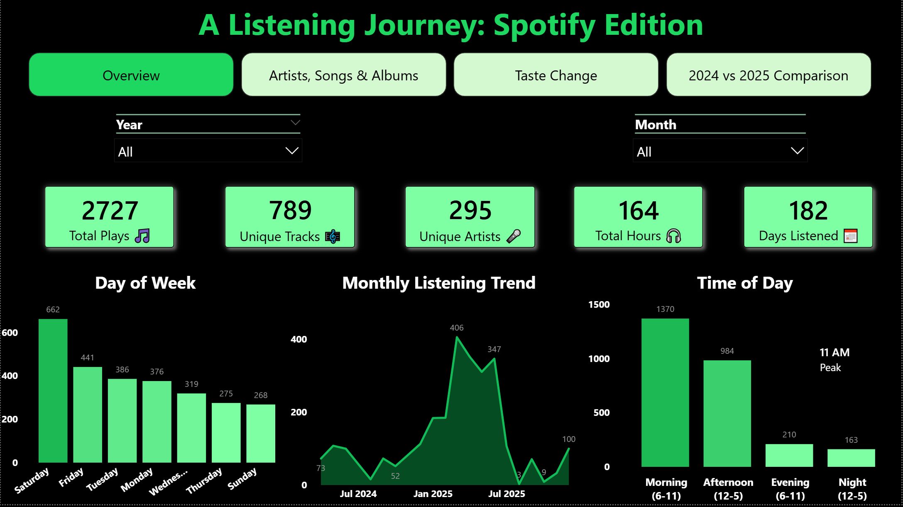
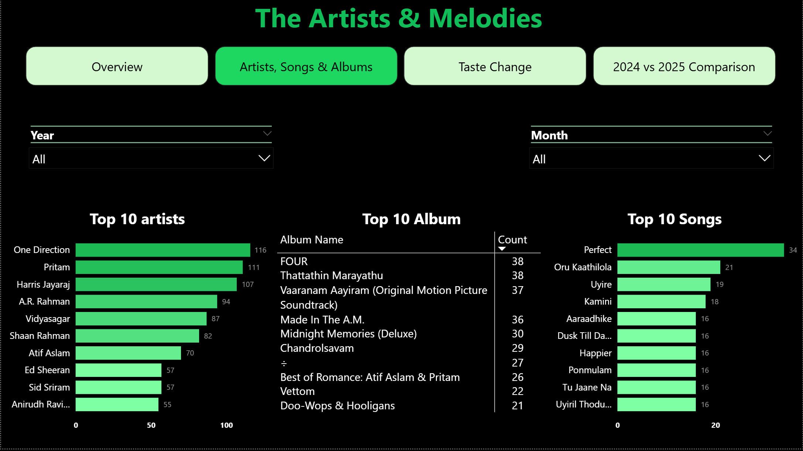

# Power BI Dashboard 

## Dashboard Overview

Interactive Power BI dashboard analyzing 20 months of Spotify listening history (Apr 2024 - Dec 2025). The dashboard features 4 interactive pages with 21 custom DAX measures, revealing listening patterns, taste evolution, and behavioral insights.

---
## Demo & Screenshots

* **Demo Video**: [Watch demo](https://drive.google.com/file/d/1dGQsEUa4y6WraE5n2c2CLhZTDG-FLVE8/view?usp=sharing)

---

### Page 1: Overview - "A Listening Journey: Spotify Edition"
 

### Page 2: "The Artists & Melodies"

 

### Page 3: "The Journey of Change"

 

### Page 4: "2024 vs 2025 Comparison"

 

---
## PowerBI Features

### Page Navigation
* Four page buttons enable seamless navigation between dashboard sections
* Each page is themed with consistent Spotify dark background (#191414)
* Interactive filters allow dynamic exploration across years and months

### Page 1: Overview - "A Listening Journey: Spotify Edition"
* 6 KPI cards: Total Plays, Unique Tracks, Unique Artists, Total Hours, Days Listened, Peak Listening Hour
* Year and Month slicers for temporal filtering
* Day of Week (Clustered Column Chart)
* Monthly Listening Trend (Area Chart)
* Time of Day (Clustered Column Chart)

### Page 2: "The Artists & Melodies"
* Year and Month slicers
* Top 10 Artists (Horizontal Bar Chart)
* Top 10 Songs (Horizontal Bar Chart)
* Top 10 Albums (Table visual)

### Page 3: "The Journey of Change"
* Period Selector (4 Chiclet slicers): Period 1-4 divided across 6-month intervals
* Skip Rate Trend (Line Chart with markers)
* Listening Hours This Period (Card)
* Top 3 Songs This Period (Table)
* Skipped Summary (Matrix)
* Skip Patience (Donut Chart)
* New Artists Table

### Page 4: "2024 vs 2025 Comparison"
* Multi-card section displaying:
  * Top Artist 2024
  * Top Artist 2025
  * Top Album 2024
  * Top Album 2025
  * Top Song 2024
  * Top Song 2025
  * Swipe Instructions
* Artist Consistency (Gauge Chart)
* New Artists 2025 (Card)
* Loyal Artists (Card)
* Skip Rate Comparison (Line & Stacked Column Chart)
* Listening Hours Monthly (Matrix)
* Listening Time Distribution (Clustered Column Chart)

---

## Tables

### spotify_listening_history_1
* Source: Spotify Extended Streaming History JSON export
* Dimensions: 2,727 records, 7 columns
* Key columns: ts (timestamp), ms_played, master_metadata_track_name, master_metadata_album_artist_name, master_metadata_album_album_name, skipped, spotify_track_uri
* Used for: All visualizations across all pages

### Skipped_Summary
* Purpose: Combines top 5 skipped songs, artists, and albums into a single table
* Structure: UNION of three SELECTCOLUMNS queries
* Columns: Item (track/artist/album name), Category (Top Skipped Songs/Artists/Albums), Skip Count (number of skips)
* Used in: Skipped Summary matrix on Page 3

---

## Calculated Columns

### 1. Period
* Purpose: Segments listening history into 4 time periods for temporal analysis
* Values: Period 1 (Apr-Sep 2024), Period 2 (Oct 2024-Mar 2025), Period 3 (Apr-Sep 2025), Period 4 (Oct-Dec 2025)
* Used in: Period slicer on Page 3; Skip Rate measure

### 2. Skip Patience
* Purpose: Categorizes skips by how long a track plays before being skipped
* Formula: SWITCH based on ms_played duration
* Values: 
  * Immediate Skip (<15 seconds)
  * Gave it a Chance (15-45 seconds)
  * Listened a Bit (45 seconds - 2 minutes)
  * Listened Most (>2 minutes)
* Used in: Skip Patience donut chart on Page 3

### 3. Time of Day
* Purpose: Categorizes listening activity by time of day for temporal pattern analysis
* Values: Morning (6-11 AM), Afternoon (12-5 PM), Evening (6-11 PM), Night (12-5 AM)
* Used in: Time of Day clustered column chart on Page 1; Listening Time Distribution chart on Page 4

### 4. Year Column
* Purpose: Extracts year from timestamp for year-over-year comparisons
* Values: 2024, 2025
* Used in: Connecting_Line measure; Year-based filtering and 2024 vs 2025 comparisons on Page 4

### 5. Is_New_Artist_All_Periods
* Purpose: Identifies artists appearing for the first time in each period
* Formula: SWITCH statement checks if artist appears in current period but not previous period
* Used in: New Artists Table on Page 3

---

## DAX Measures (23 Total)

1. Total Plays – Total streaming count across dataset
2. Unique Tracks – Count of distinct songs listened to
3. Unique Artists – Count of distinct artists discovered
4. Total Listening Hours – Total listening time in hours
5. Days Listened – Number of days with listening activity
6. Skip Rate – Percentage of tracks skipped per period
7. Listening Hours Period – Dynamic display of hours in selected period
8. Artist Overlap Count – Number of top 10 artists appearing in both 2024 and 2025
9. New Artists 2025 – Count of artists in 2025 not present in 2024
10. Loyal Artists – Count of top 20 artists appearing in both 2024 and 2025
11. Skip Rate 2024 – Skip percentage for 2024 (20.55%)
12. Skip Rate 2025 – Skip percentage for 2025 (12.52%)
13. Connecting Line – Returns appropriate skip rate for trend line visualization by year
14. Listening Hours Monthly – Aggregated listening hours by month
15. Time Distribution – Proportion of plays by time of day within year
16. Top Artist 2024 – Top artist in 2024 by play count
17. Top Artist 2025 – Top artist in 2025 by play count
18. Swipe Instructions – Display text for navigation guidance
19. Peak Listening Hour – Hour of day with highest play count
20. Top Album 2024 – Most-played album in 2024
21. Top Album 2025 – Most-played album in 2025
22. Top Song 2024 – Most-played track in 2024
23. Top Song 2025 – Most-played track in 2025
